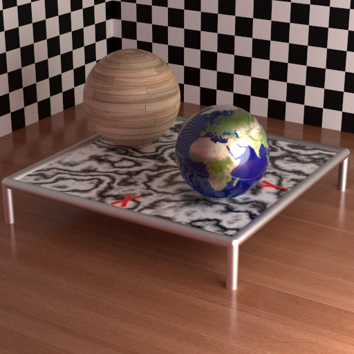
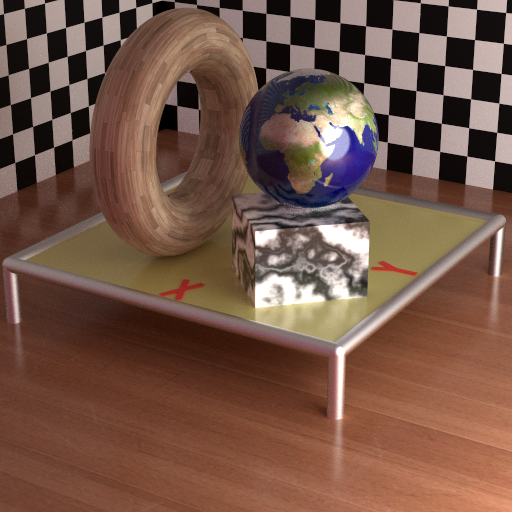
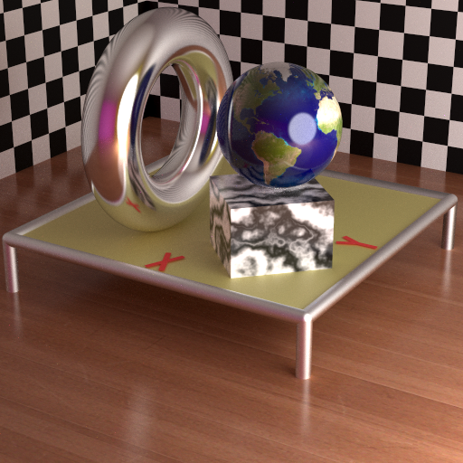

# Raytracer
Path tracing algorithm implementation

This is a pretty full featured implementation of a path tracing algorithms featuring:

* Reflective micro-facet BRDF
* Refraction (Snell's law)
* Light absorption through colored medium
* Multiple Importance Sampling (MIS)
* Model transformations (position, rotation, etc)
* Support ray intersection with sphere, cylinder, box, triangle meshes, and torus
* Procedural textures (checkerboard) and perlin noise (marble surfaces)

